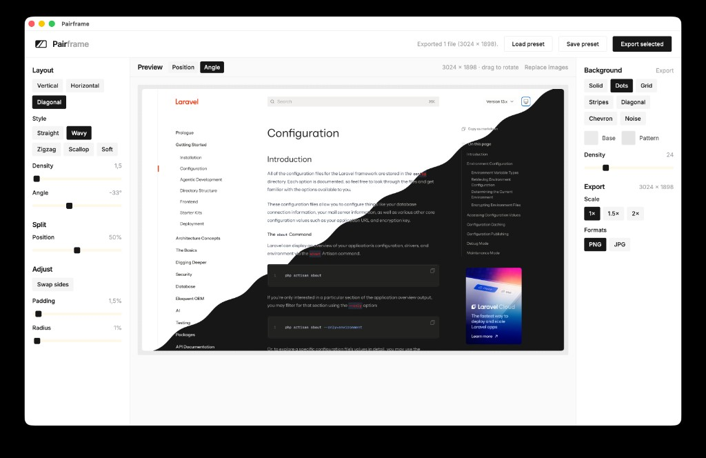

# Pairframe

NativePHP desktop app to compose two screenshots into split or overlap thumbnails, with background patterns and PNG, JPG, or transition-video export.



**Heads up: this project is AI-assisted.** A lot of the code and docs were written with AI tools (reviewed and steered by me). Pairframe exists first for my own thumbnail workflow; I open-sourced it in case it helps someone else. Issues and pull requests are welcome, just know what you're looking at.

## Downloads

Prebuilt macOS and Windows installers are on the [GitHub Releases](https://github.com/CodeWithDennis/pairframe/releases) page.

**These builds are unsigned.** On macOS, Gatekeeper may block the app until you allow it:

1. Open Pairframe (you may see “cannot be opened”, “damaged”, or “unidentified developer”).
2. Go to **System Settings → Privacy & Security**.
3. Choose **Open Anyway** / **Allow** for the blocked app.
4. Confirm again if macOS asks.

Alternatively, [build locally](#build-locally) instead of using a downloaded installer.

### Auto-updates

Release builds check GitHub Releases for updates.

- **Windows:** updates can install without code signing (SmartScreen may still warn).
- **macOS:** automatic updates only work for signed and notarized builds. Unsigned builds need a manual download from Releases.

## Requirements

- PHP 8.4+
- Composer
- Node.js 22+
- npm

## Setup

```bash
composer install
cp .env.example .env
php artisan key:generate
npm install
npm run build
php artisan native:install --no-interaction
```

Or run `composer run setup`, then `php artisan native:install --no-interaction`.

## Develop in the browser

```bash
composer run dev
```

Open the app URL and upload two screenshots.

## Run as desktop app

```bash
npm run build
php artisan native:run
```

For a live Vite + NativePHP loop:

```bash
composer native:dev
```

## Build locally

After [Setup](#setup):

```bash
npm run build
php artisan native:build
```

Target a specific OS / architecture when supported on your host:

```bash
php artisan native:build mac arm64
php artisan native:build mac x64
php artisan native:build win x64
```

Installers land in `nativephp/electron/dist/` (for example `.dmg` / `.zip` on macOS, `.exe` on Windows).

Local builds are unsigned unless you configure Apple or Windows code signing. Prefer `php artisan native:run` for day-to-day development.

## Features

- Upload two screenshots (PNG, JPG, WebP)
- Layouts: vertical, horizontal, diagonal, and overlap (cards, side, stack)
- Split edge styles (vertical / horizontal / diagonal): straight, wavy, zigzag, scallop, soft, torn, pixel (with density)
- Split position, angle, padding, border radius, and optional shadow on overlap
- Theme (light / dark / auto), per-image labels (9-point presets + custom X/Y), badge, and swap sides
- Background patterns with custom colors and density (optional per-side A/B)
- Overlay pattern marks only (dots, grid, and more) with color, opacity, and density — no base fill; optional per-side A/B
- Collapsible sidebar groups with scrollable panels and per-group reset (shown when dirty)
- Save / load settings presets (images are not stored)
- Export PNG or JPG at optional scale (1×, 1.5×, 2×), transition video (MP4 / WebM), or animated GIF — with easing and hold-start/hold-end
